# Bitcoin Prediction System 

## Table of Contents

1. [System Architecture Overview](#system-architecture-overview)
2. [Data Collection Flow](#data-collection-flow)
3. [Feature Engineering Pipeline](#feature-engineering-pipeline)
4. [Model Training Flow](#model-training-flow)
5. [Prediction Pipeline](#prediction-pipeline)
6. [Service Lifecycle](#service-lifecycle)
7. [Dashboard Architecture](#dashboard-architecture)
8. [Continuous Learning Flow](#continuous-learning-flow)
9. [Error Handling & Recovery](#error-handling--recovery)
10. [File Dependencies](#file-dependencies)

---

## System Architecture Overview

### High-Level System Architecture

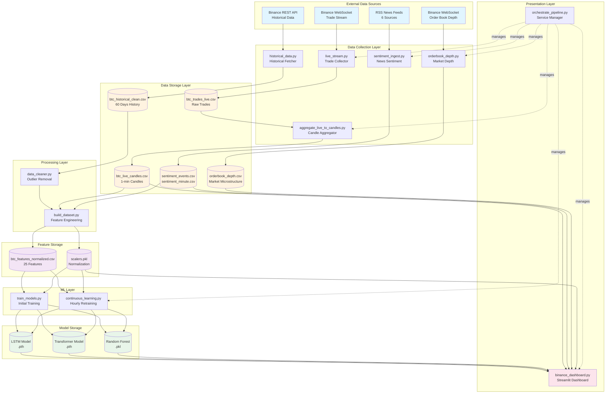

---

## Data Collection Flow

### Live Trade Streaming (live_stream.py)

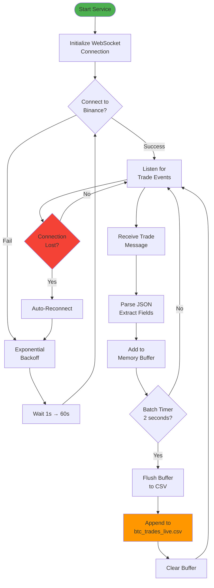

### Candle Aggregation (aggregate_live_to_candles.py)

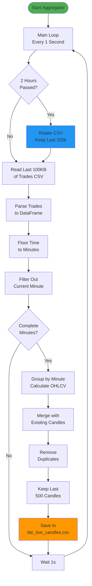

### Sentiment Collection (sentiment_ingest.py)

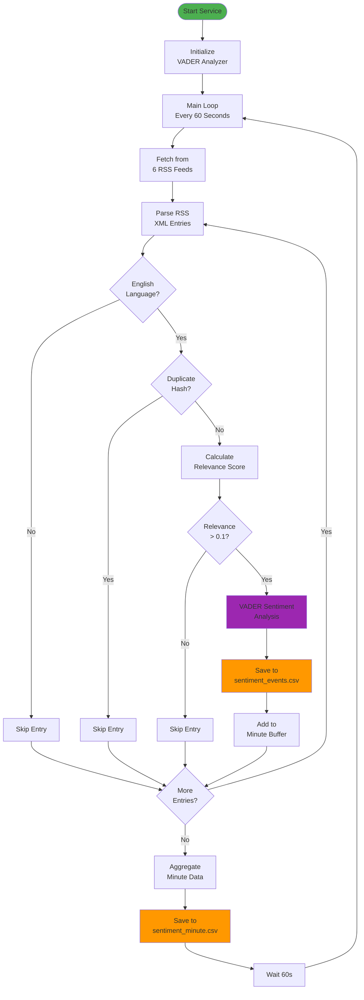

---

## Feature Engineering Pipeline

### Complete Feature Engineering Flow

```mermaid
flowchart TD
    Start([build_dataset.py<br/>Triggered]) --> LoadHist[Load Historical<br/>btc_historical_clean.csv]
    LoadHist --> LoadLive[Load Live Candles<br/>btc_live_candles.csv]
    
    LoadLive --> Merge1[Merge Historical<br/>+ Live]
    Merge1 --> Dedupe[Remove Duplicates<br/>by timeOpen]
    Dedupe --> Sort[Sort by<br/>timeOpen]
    
    Sort --> TechFeatures[Create Technical<br/>Features]
    
    TechFeatures --> Lag[Lag Features<br/>lag_1, lag_5, lag_15]
    Lag --> Returns[Log Returns<br/>log_return]
    Returns --> MA[Moving Averages<br/>ma_5, ma_15, ma_60]
    MA --> Vol[Volatility<br/>vol_5, vol_15, vol_60]
    Vol --> RSI[RSI Indicator<br/>rsi_14]
    RSI --> MACD[MACD<br/>line, signal, histogram]
    MACD --> BB[Bollinger Bands<br/>upper, middle, lower]
    BB --> EMA[EMA<br/>ema_12, ema_26]
    
    EMA --> LoadSent[Load Sentiment<br/>sentiment_minute.csv]
    LoadSent --> MergeSent[Merge on<br/>timeOpen]
    
    MergeSent --> ForwardFill[Forward Fill<br/>Missing Sentiment]
    ForwardFill --> Features25[25 Features<br/>Complete]
    
    Features25 --> Split[Split Train/Val<br/>80% / 20%]
    Split --> FitScalers[Fit MinMaxScaler<br/>on Train Data]
    FitScalers --> Transform[Transform<br/>All Data]
    
    Transform --> SaveFeatures[Save<br/>btc_features_normalized.csv]
    SaveFeatures --> SaveScalers[Save<br/>scalers.pkl]
    SaveScalers --> End([Complete])
    
    style Start fill:#4caf50
    style TechFeatures fill:#2196f3
    style LoadSent fill:#9c27b0
    style SaveFeatures fill:#ff9800
    style SaveScalers fill:#ff9800
    style End fill:#4caf50
```

### Feature Calculation Details

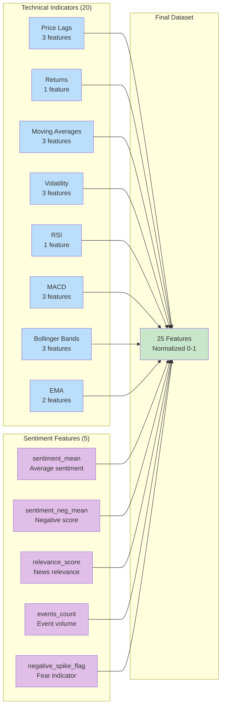

---

## Model Training Flow

### Initial Training Process (train_models.py)

```mermaid
flowchart TD
    Start([train_models.py<br/>Started]) --> Load[Load Normalized<br/>Features CSV]
    Load --> CreateSeq[Create Sequences<br/>60 timesteps]
    
    CreateSeq --> Split[Split Data<br/>80% Train / 20% Val]
    Split --> Baseline{Train<br/>Baseline?}
    
    Baseline -->|Yes| RF[Random Forest<br/>Regression]
    RF --> SaveRF[Save<br/>btc_model_reg.pkl]
    
    Baseline -->|No| Deep
    SaveRF --> Deep{Train Deep<br/>Learning?}
    
    Deep -->|Yes| CheckGPU{GPU<br/>Available?}
    CheckGPU -->|Yes| UseGPU[Use CUDA]
    CheckGPU -->|No| UseCPU[Use CPU]
    
    UseGPU --> InitLSTM[Initialize LSTM<br/>2 layers, 64 units]
    UseCPU --> InitLSTM
    
    InitLSTM --> TrainLSTM[Train LSTM<br/>10 epochs, early stop]
    TrainLSTM --> SaveLSTM[Save<br/>btc_model_reg.pth]
    
    SaveLSTM --> InitTrans[Initialize Transformer<br/>2 layers, 4 heads]
    InitTrans --> TrainTrans[Train Transformer<br/>10 epochs, early stop]
    TrainTrans --> SaveTrans[Save Alternative<br/>Model]
    
    SaveTrans --> Evaluate[Evaluate All<br/>Models]
    Evaluate --> Compare[Compare<br/>Performance]
    Compare --> SelectBest[Select Best<br/>Model]
    SelectBest --> Report[Generate<br/>Metrics Report]
    
    Deep -->|No| Report
    Report --> End([Training<br/>Complete])
    
    style Start fill:#4caf50
    style RF fill:#ff9800
    style InitLSTM fill:#2196f3
    style InitTrans fill:#9c27b0
    style End fill:#4caf50
```

### Model Architecture Details

```mermaid
graph TB
    subgraph "LSTM Architecture"
        L1[Input Layer<br/>60 timesteps × 25 features]
        L2[LSTM Layer 1<br/>64 hidden units<br/>20% dropout]
        L3[LSTM Layer 2<br/>64 hidden units<br/>20% dropout]
        L4[Take Last Timestep<br/>64 features]
        L5[Fully Connected<br/>64 → 1]
        L6[Output<br/>Predicted Return]
        
        L1 --> L2
        L2 --> L3
        L3 --> L4
        L4 --> L5
        L5 --> L6
    end
    
    subgraph "Transformer Architecture"
        T1[Input Layer<br/>60 timesteps × 25 features]
        T2[Embedding<br/>25 → 64 dimensions]
        T3[Transformer Encoder<br/>2 layers, 4 heads]
        T4[Take Last Timestep<br/>64 features]
        T5[Fully Connected<br/>64 → 1]
        T6[Output<br/>Predicted Return]
        
        T1 --> T2
        T2 --> T3
        T3 --> T4
        T4 --> T5
        T5 --> T6
    end
    
    subgraph "Random Forest"
        R1[Input<br/>25 features<br/>last row only]
        R2[100 Decision Trees<br/>max_depth=10]
        R3[Ensemble Vote<br/>Average predictions]
        R4[Output<br/>Predicted Return]
        
        R1 --> R2
        R2 --> R3
        R3 --> R4
    end
    
    style L1 fill:#e3f2fd
    style L6 fill:#c8e6c9
    style T1 fill:#f3e5f5
    style T6 fill:#c8e6c9
    style R1 fill:#fff3e0
    style R4 fill:#c8e6c9
```

---

## Prediction Pipeline

### Real-Time Prediction Flow

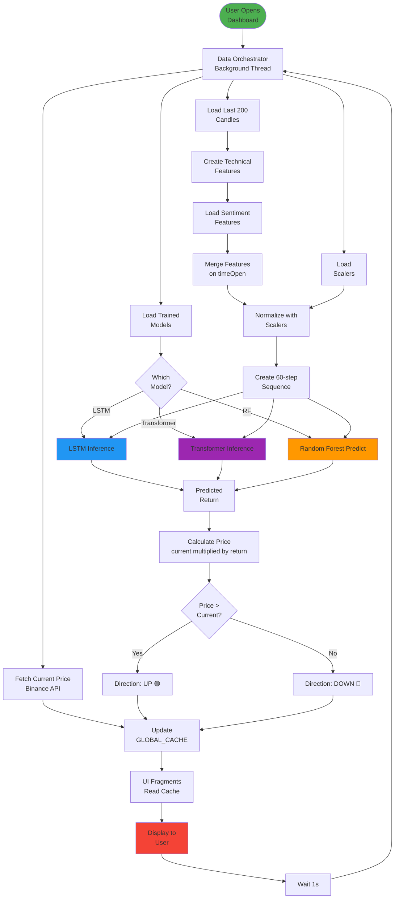

---

## Service Lifecycle

### System Startup Sequence

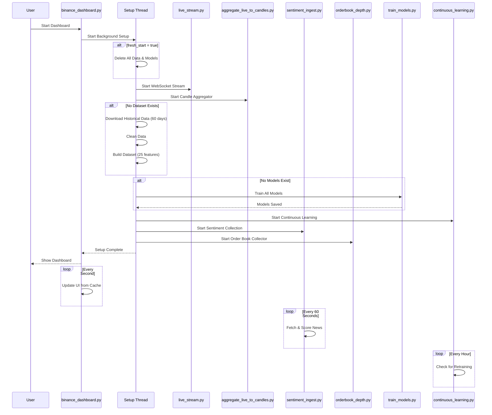

### Service Dependencies

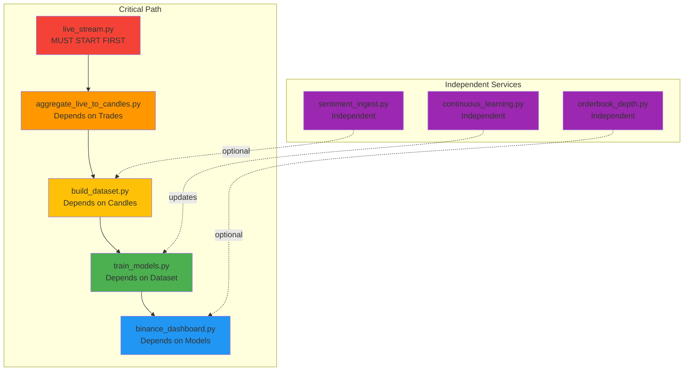

---

## Dashboard Architecture

### Dashboard Component Structure

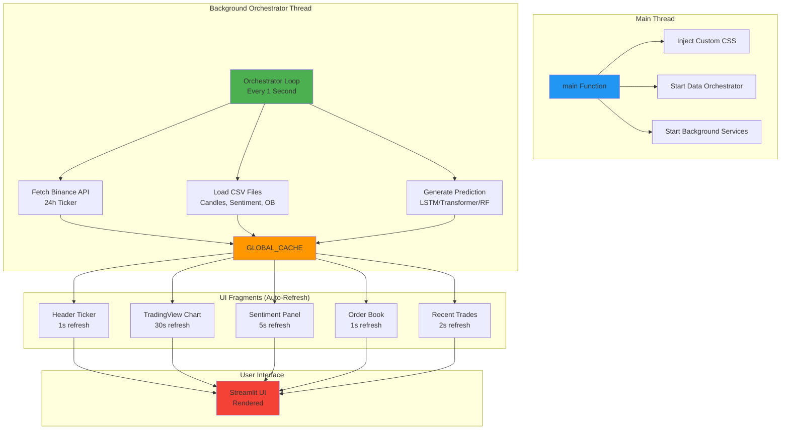

### Dashboard Data Flow

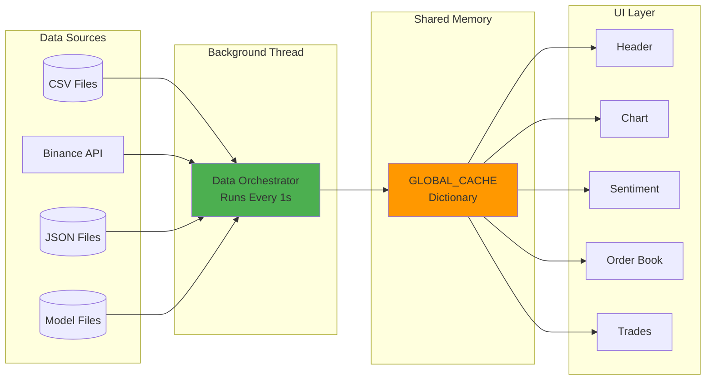

---

## Continuous Learning Flow

### Continuous Learning Process

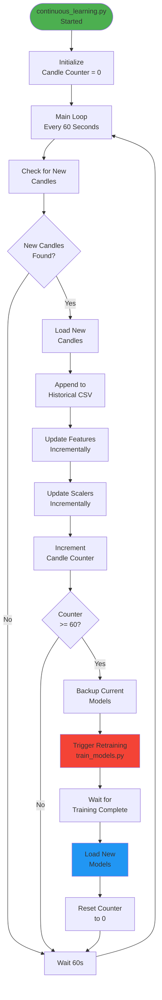

### Retraining Timeline

```mermaid
gantt
    title Continuous Learning Timeline
    dateFormat HH:mm
    axisFormat %H:%M
    
    section Data Collection
    Live Trades Streaming     :active, 00:00, 120m
    Candle Aggregation        :active, 00:00, 120m
    
    section Feature Updates
    New Candle 1              :milestone, 00:01, 0m
    New Candle 30             :milestone, 00:30, 0m
    New Candle 60             :milestone, 01:00, 0m
    
    section Retraining
    Trigger Retraining        :crit, 01:00, 10m
    Model Training            :crit, 01:00, 10m
    Load New Models           :crit, 01:10, 1m
    
    section Next Cycle
    Continue Collection       :active, 01:11, 49m
    Next Retrain              :milestone, 02:00, 0m
```

---

## Error Handling & Recovery

### WebSocket Reconnection Strategy

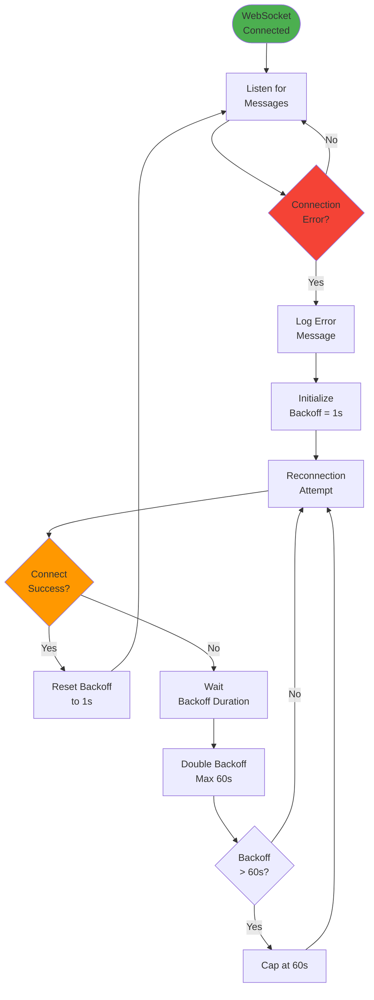

### Data Validation Flow

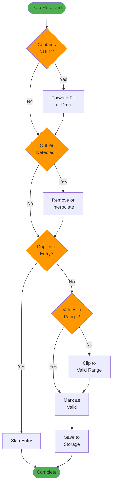

---

## File Dependencies

### File Dependency Graph

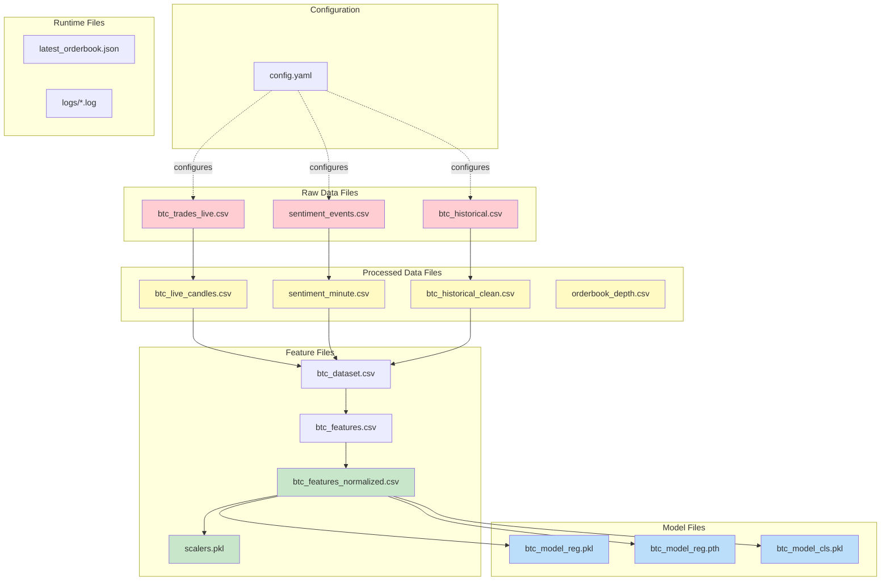

### File Lifecycle

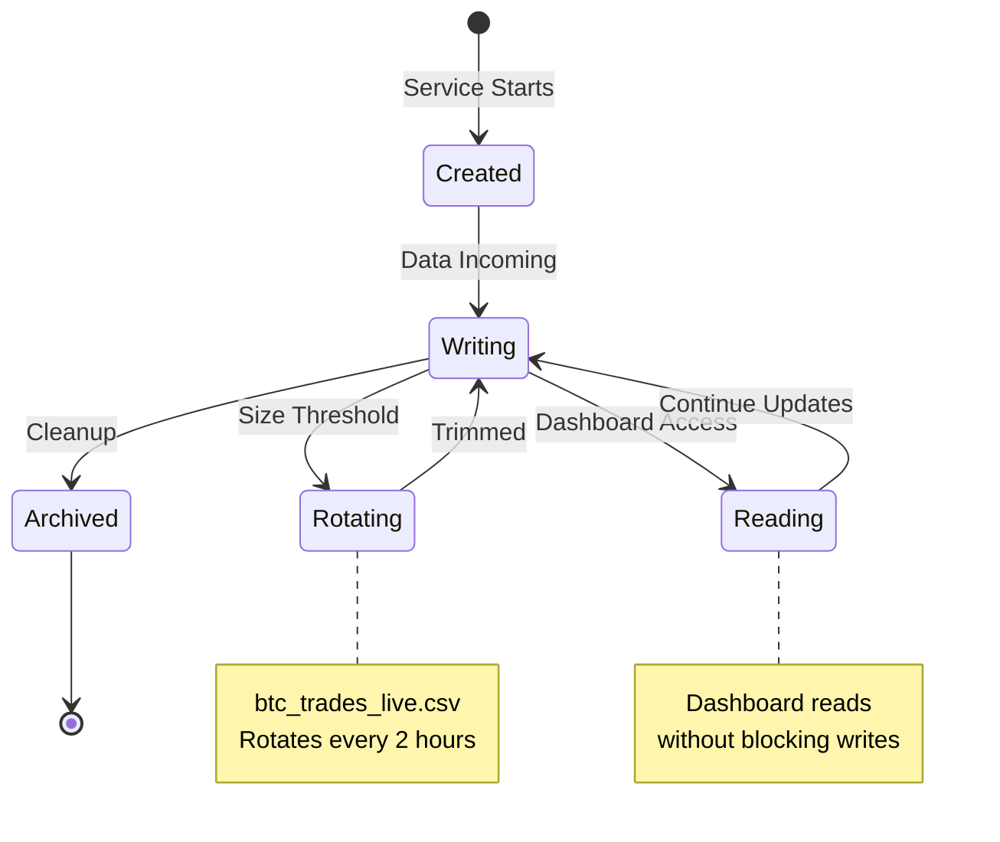

---

## Summary

This comprehensive diagram collection covers:

✅ **System Architecture**: Complete overview of all components
✅ **Data Flows**: How data moves through the system
✅ **Process Flows**: Detailed step-by-step operations
✅ **Service Interactions**: How services communicate
✅ **Error Handling**: Recovery mechanisms
✅ **File Dependencies**: Data lineage and relationships

```

```


